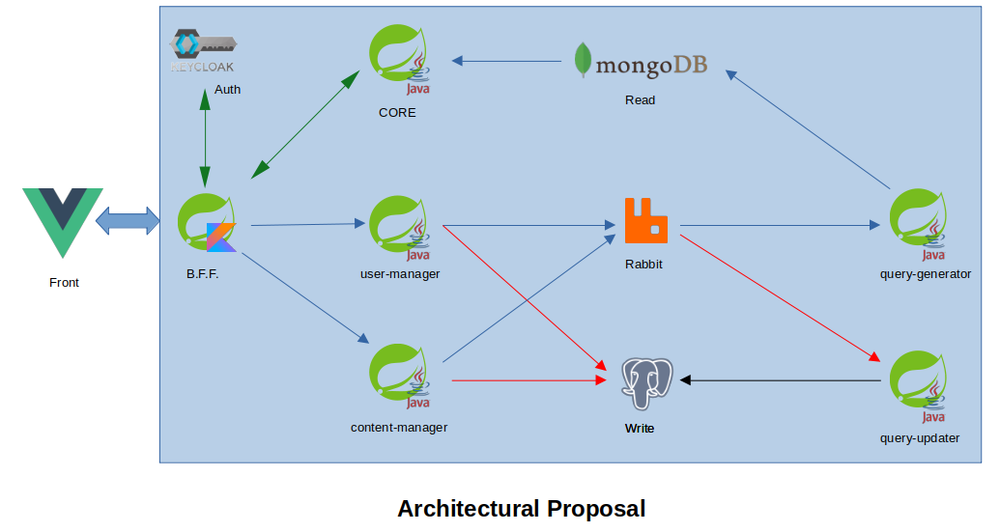

# Distro Contrast

-------------------------------

## Description

This project is based on implementing a centralized solution containing data from comparative performance tests of several Linux distributions, made by some famous YouTubers in the Linux world.

```REMEMBER: THE INTENT IS NOT TO SAY WHICH LINUX IS BETTER. THE BEST IS RELATED TO THE EXPERIENCE OF EACH ONE.```

Here have inserting 3 modules (for while) whom contain some of the microservices about back end. More specifically about user and content manager 

This project is still under development.

## Modules

* content-manager: microservice whom perform with data that are inserting into the system by the users.
* content-query: microservice that it's seems like a Lambda operator whom intercept the message queue and turn this data into information for the database to read.
* user-manager: microservice that operate users, based on GDPL (General Data Protection Law)

## Main idea

